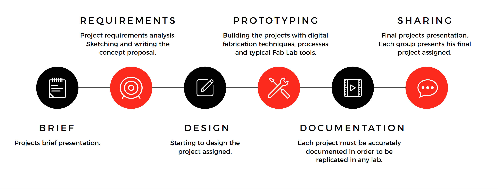
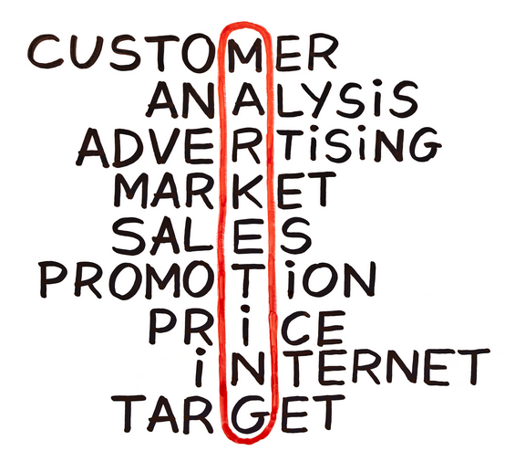

# Product Workflow

## Product workflow phases

The product workflow is made by several phases.

- Brief
- Requirements
- Design
- Prototyping
- Documentation
- Shaaring

## Brief

Everything starts with a product brief. Either a potential customer made a specific request or the company management decided to pursue a business opportunity.

What the brief tells is the expected result to be achieved, at the level of detail of a concept.

Often the brief also include technical and usability requirements, which will have to be validated in the following phases.

An effective brief can save some time during development, but everything written has to be taken with precaution and checked continuosly during an extensive analysis of requirements.

## Requirements

The goal of this phase is to define which are the requirements that the products needs to satisfy according to the different stakeholders involved, their usage scenarios and of course to the limitations imposed by technology.

The requirements phase is essential to achieve a good product, 
and requirements must be checked continuosly during all other phases.

A shortcut taken to save some headaches for the production might negatively impact the product and in the end sales.

Requirements must be checked against real users to be fully validated. Several approaches exist including user groups,
interviews, study groups, A/B testing, etc.

The way we'll try to test requirements is quite revolutionary and only allowed by the recent technologies introduced with the
digital fabrication.

What we'll do is to test minimal working products, or MVPs with
potential customers, asking what they think about them and what should be improved to build an optimal product.

We can also try selling these products in a local market for a more real-world scenario, but this needs to be done only when the product is mature enough (and safe) to be really useful to the buyer.

## Design

The design phase follows a typical scenario in the consumer electronics world.

The technical components for the product often come from an existing product, or produced by a third party and ready to be integrated. 

Especially in China, where tens or hundreds of variants of the same product flood the market before settling into a specific design, most of the products have the same intrinsic characteristics, while changing in components selection, design, materials, packaging and so on.

In order to be attractive to consumers, products need several design elements to be provided:

- a sleek enclosure, communicating the level of the product in the market
- a proper packaging 
- a coordinated image linked to the innovative features of the product

Starting from the technological prototypes available, our task will be that of designing the above elements for our products, paying attention to production processes that will allow us to produce small batches at an affordable cost.

## Prototyping

## Documentation

## Sharing / Marketing

