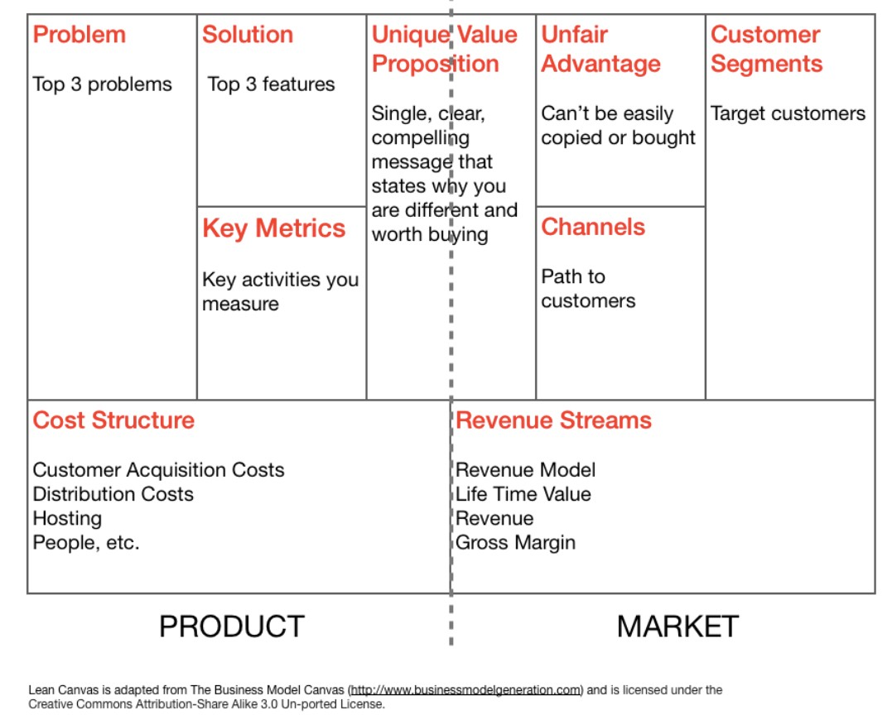
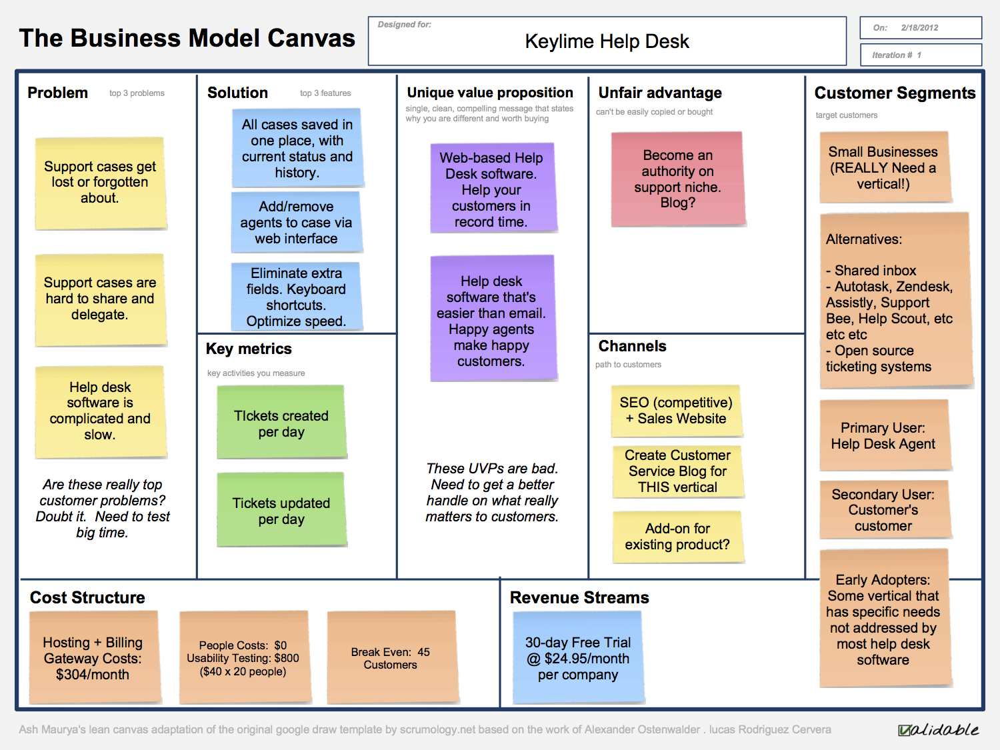

# Business Planning

Planning the business side of your project can be time consuming and frustrating. It's difficult since it requires you to make assumptions and research about how your product will be produced, sold, and which market it targets.

But since making a product requires lots of effort and resources, you want to be at least sure that you are making something that will eventually reach the market and sell well, making consumers happy and wanting more.

## Lean startup for hardware

The traditional approach to start-ups and entrepreneurship in general has been shaken significantly by a number of books such as [Business Model generation](https://www.amazon.it/Business-Model-Generation-Visionaries-Challengers/dp/0470876417), the [Lean Startup](https://www.amazon.it/Lean-Startup-Entrepreneurs-Continuous-Innovation/dp/0307887898/ref=sr_1_1?s=english-books&ie=UTF8&qid=1503722341&sr=1-1&keywords=lean+startup), and [Four steps to epiphany](https://www.amazon.it/Four-Steps-Epiphany-English-ebook/dp/B00FLZKNUQ/ref=sr_1_fkmr1_1?s=english-books&ie=UTF8&qid=1503722370&sr=1-1-fkmr1&keywords=five+steps+to+epiphany), introducing the trend of the so-called Lean Startup.

To simplify, the Lean Startup provides a number of guiding principles and tricks that help finding out sooner if a product works and when is time to produce it. 

It is based on the key concept that in the early phases of a business there are a number of assumptions that need to be proven before moving on and considering the business worth investing in.

Mainly used in the software business,  The Lean startup can be applied to any kind of business, including those manufacturing hitech or low-tech products.

The main tool used to test assumptions in this case will be a Minimum Viable Product. This is a complete product, with only the features needed to test the customer reaction, ready to be improved if there's a good response, in a new product version.

If you think about it this is the model smart companies already use for most hi-tech products, refining the product at subsequent generations by constantly tweaking it in a couple of features.

**Exercise: Take a marketing campaign and understand what assumptions the company would like to check**

## Elevator pitch

This is a short sales pitch, something that you will use to tell other people
about your product, but also what actually your product does in simple words.

Make your elevator pitch guide you through the project, it must contain the essence of it.

[Learn pitching from Steve Jobs iPhone announcement](https://www.youtube.com/watch?v=vN4U5FqrOdQ)

[Learn pitching from Richard Branson (Virgin)](https://www.youtube.com/YBwbi3hyynE)

>"As I have written previously, the first step toward delivering a great pitch is to keep it human, since far too many presentations and speeches can turn artificial and wooden quite quickly. Let your passion shine through by being yourself and allowing your points to come across naturally. Use humour to connect with your audience and demonstrate your creativity.

>"A great pitch can do many things. It can convince potential investors and clients that you are worth taking a chance on. It can also help you recruit top talent that can help your business expand. These are essential ingredients for a successful venture. Keep in mind that people want to invest in people. So talk about your previous successes. 

**Exercise: Make an elevator pitch for a product you like**

## Business canvas

The business model canvas (or Lean canvas, depending on which book you prefer between the Lean Startup or the Business Model Revolution)
is a simple but powerful tool allowing you to quickly transfer your (business) idea from your mind to a format you can share with other people.

In the past this would have required writing a Business Plan, a 100 pages document that would take few weeks at least. This will be necessary once the idea scales up, and you will be looking for investors. But for a preliminary feasibility check a canvas is all you need.

What's in the Business / Lean Canvas?

### 1. Problem

 In this box try listing the one to three high priority problems that your potential customer has. Without a problem to solve, you don’t have a product / service to offer.

### 2. Customer Segments

Which are the categories of people which have the problem highlighted before and might need / want your product.

### 3. Unique Value Proposition

Which value will deliver your product. Consider this as the main reason the buyer should choose your product and not one of a competitor for example.

### 4. Solution

What is the solution for the problem. It might be a technological solution, but you need to check with the potential customer if it's the right one they are willing to buy.

Asking will also help you find other solutions worth investigating.

### 5. Channels

How you will reach your customers, for marketing and selling your product. Focus on the channels you can afford, i.e. local newspaper ad vs superbowl 30'' adv, and make you learn more about your actual customers.

### 6. Revenue streams

How you will make money with your product. Include any recurring revenue stream, for example service subscriptions, or licensing to third parties.

### 7. Cost structure

Describe all costs for getting your product to the market. 
Define how much money you need each month and match it to the revenue streams to find the break-even point (when expenses will be equal to income, after covering all the losses).

### 8. Key Metrics

How will you measure your product success, for examples number of sales, 
subscriptions, growth per quarter, etc.

### 9. Unfair Advantage

This should include what your competitors cannot get and you have in terms of advantage. For example a patented technology, the founders expertise in a specific field, specific territorial assets.

## Exmple

Here an example of a Lean canvas for a business

**Exercise: pick a random business idea an try to make a business canvas for it, for example an icecream shop for vegans, a training center for tiny dogs, a restaurant where they serve only green food, etc**