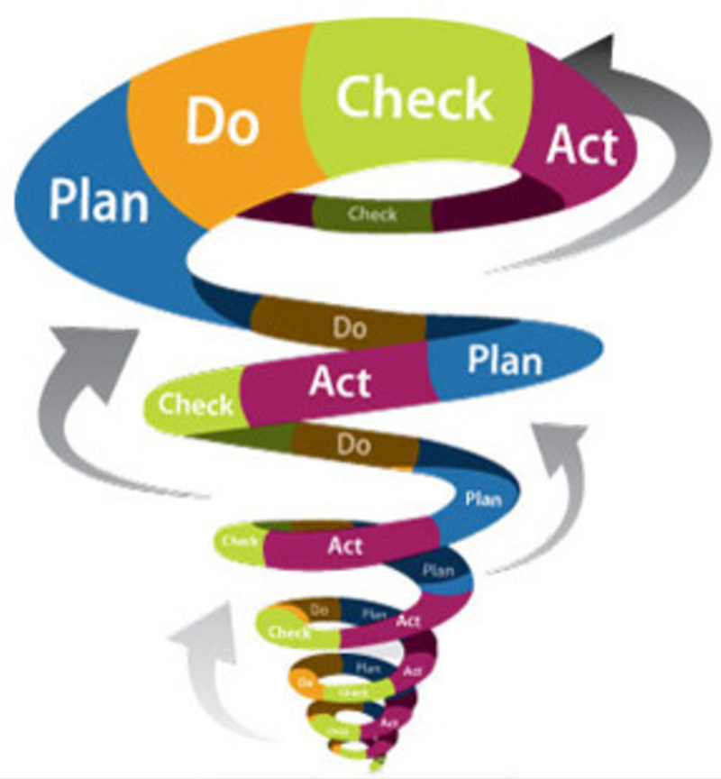
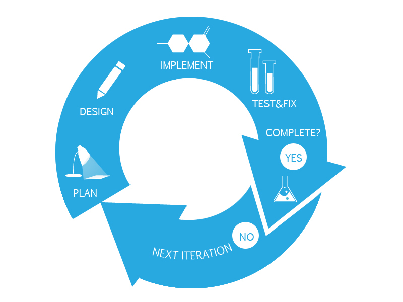

# Project Development techniques

## Waterfall development

Brief -> Requirements -> Design -> Prototyping -> Documentation -> Sharing

## Spiral development

Same as the above, just repeated in a cycle, with very fast **iterations**.

We move to the next phase as soon as we have something to work on the next one. Then repeat.

**We always have something working to show.**

## Agile development

The development is driven by requirements, and works in sprints. Every sprint is related to a number of selected requirements choosen with the customer.

