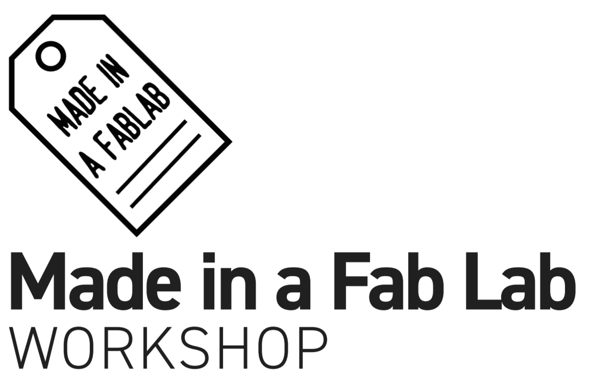

This manual provides useful reference to successfully follow a Made in a Fab Lab Workshop.

The content is split according to the different areas covered during the workshop.

## The workshop

### [General Notes](01_general_notes.md)

Methodology, how work is planned, and expected outcomes.

### [Workshop introduction](02_workshop_intro.md)

Introduction to Made in a Fab Lab: Manifesto, Materials and Reuse, Licensing and Creative Commons.

## From prototype to product

### [Product Workflow](03_product_workflow.md)

Workflow overview: what needs to be done from brief to final product.

### [Project requirements](04_project_requirements.md)

Projects brief: how to interpret and analyse the requirements.

### [Workgroups](05_workgroups.md)

Workgroup organisation: making groups, identify and explain roles.

### [Documentation](06_documentation.md)

Project documentation: documenting the different parts of the project and construction plans.

### [Designing a product digitally](13_design.md)

Designing a product starting from a scaffold. 

### [Chapter 11: Digital Fabrication for local production](11_digifab.md)

1. State of the Art

2. Digital fabrication for local production

3. Practical examples

## From product to market

### [Business Planning](07_business_planning.md)

Business planning: identifying production processes, distribution channels, value propositions, competitors and relevant stakeholders, drafting a business canvas.

Defining licensing options, among the different available.

### [Marketing & Communication](08_marketing.md)

Marketing: how to communicate the product, making a splash page and performing A/B testing.

### [Financing options](09_financing.md)

Financing: exploring different possibilities including local distribution, crowdfunding, angel and venture capital.

### [Fullfilment](10_fulfillment.md)

Producing and delivering products: how to plan and deliver a physical product

## Examples

### [Example projects](12_project_briefs.md)

Cards describing Made in a Fab Lab inspirational projects and ideas for building products around them.

